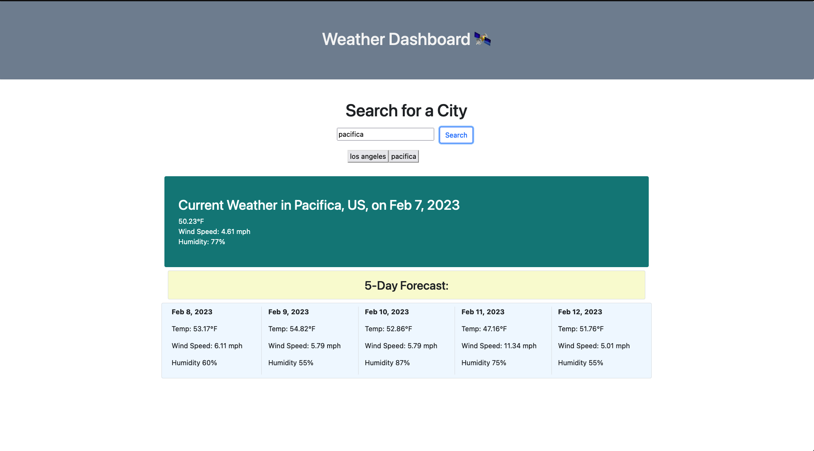

# Weather Dashboard

## Description
This project is a 9am to 5pm day planner built using JavaScript, Bootstrap, HTML, and CSS. Link to deployed application:

## Usage
This application includes the following functionality:

- search functionality to display current weather of city user inputs into search bar
- also displays 5 days of weather forecast
- saves user input to local storage and allows user to pull up weather/forecast data by clicking on previous search result

## Screenshot
